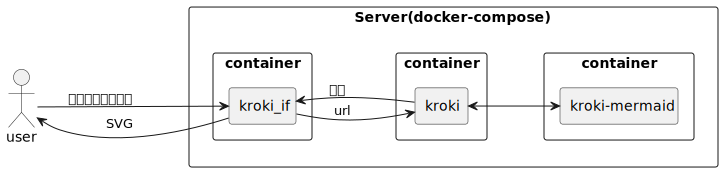

# kroki_if

krokiのフロントエンドwebアプリ。krokiサーバへテキストデータを送信して、画像データを取得するためのインターフェース

# Quick Start
```bash
cd docker
docker build --tag kroki_if_web .
docker-compose up -d
```

# アーキテクチャ



# 使い方
## 図を作成する
- http://localhost:8080 へブラウザでアクセス
- テキストエリアへコードを入力
- Generateボタンを押す

## サーバを変更する
- src/config.iniの内容を書き換える
    - サーバのアドレスとポートを設定する
- kroki_ifのdockerコンテナを再起動する

## webアプリを更新する
- app.pyやそこから呼ばれているhtml、javascript等を更新
- kroki_ifのdockerコンテナを再起動する


[kroki](https://kroki.io/)
